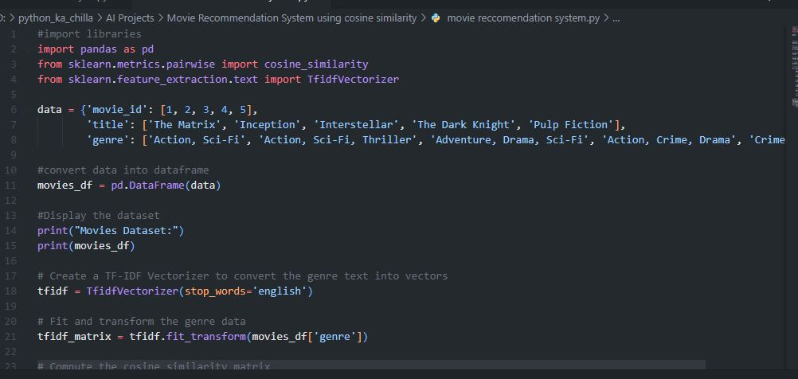
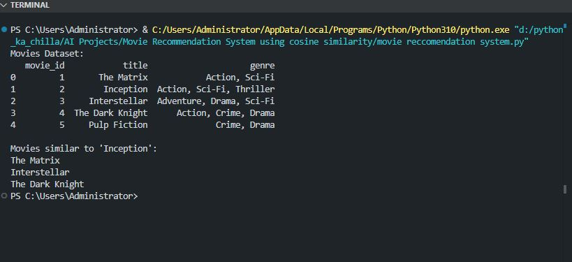

# 🎬 Movie Recommendation System using Cosine Similarity 🍿  
    

<p align="center">
  
</p>

🚀 This project implements a **content‑based movie recommendation system** that suggests movies similar to a given title based on **genre similarity**. It uses **TF‑IDF vectorization** to convert genre descriptions into numerical features and **cosine similarity** to measure how closely related movies are. Perfect for learning the fundamentals of recommendation systems.

---

## ✨ Key Features  
🎥 **Content‑Based Filtering** – Recommends movies based on genre overlap  
🔢 **TF‑IDF Vectorization** – Converts text (genres) into numerical vectors  
📐 **Cosine Similarity** – Measures similarity between movies  
📊 **Simple Dataset** – Small example dataset for easy understanding  
🧠 **Educational Code** – Well‑commented, easy to extend  

---

## 🧠 Tech Stack  
- **Language:** Python 🐍  
- **Libraries:** pandas, scikit‑learn  
- **Techniques:** TF‑IDF, Cosine Similarity  
- **Recommended IDE:** VS Code / PyCharm 💻  

---

## 📦 Installation  

```bash
git clone https://github.com/SayabArshad/Movie-Recommendation-Cosine-Similarity.git
cd Movie-Recommendation-Cosine-Similarity
pip install pandas scikit-learn
```
---

## ▶️ Usage

Run the main script:

```bash
python "movie reccomendation system.py"
```

The script will:

Display the sample movie dataset.

Compute TF‑IDF vectors for each movie’s genre.

Calculate cosine similarity between all movies.

Show the top 3 movies most similar to a given title (default: "Inception").

---

## 📁 Project Structure

```
Movie-Recommendation-Cosine-Similarity/
│-- movie reccomendation system.py  
│-- README.md                         
│-- assets/                          
│    ├── code.JPG
│    └── output.JPG
```
---

## 🖼️ Interface Previews

| 📝 Code Snippet | 📊 Console Output |
|:---------------:|:-----------------:|
|  |  |

---

## 💡 About the Project

This project demonstrates a simple yet effective content‑based recommendation approach. Using a small dataset of five movies with their genres, the system builds a TF‑IDF matrix and computes pairwise cosine similarities. For a given movie, it returns the three most similar movies based on genre overlap. While this example is minimal, the same technique scales to larger datasets and more informative features (like plot summaries, actors, etc.). It’s a great starting point for understanding how platforms like Netflix suggest content.


---

## 🧑‍💻 Author

**Developed by:** [Sayab Arshad Soduzai](https://github.com/SayabArshad) 👨‍💻

📅 **Version:** 1.0.0

📜 **License:** MIT License


---

## ⭐ Contributions

Contributions are welcome! Fork the repository, open issues, or submit pull requests to enhance functionality (e.g., using a larger dataset, adding more features, or building a web interface).
If you find this project helpful, please ⭐ star the repository to show your support.

---

## 📧 Contact

For queries, collaborations, or feedback, reach out at **[sayabarshad789@gmail.com](mailto:sayabarshad789@gmail.com)**

---

🎥 Find your next favorite movie, based on what you already love.

---
